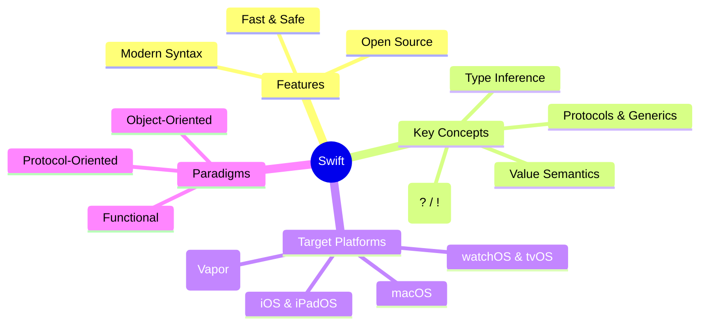

<div align="center">

# 🍏 30 Days of Swift

**A daily, hands-on journey from Swift fundamentals to real-world iOS architecture.**

[](#)
[](#)
[](https://opensource.org/licenses/MIT)

</div>

---

## 📌 About This Project

This repository serves as an open-source documentation log for mastering the Swift programming language. Each day contains:
- Clear concept explanations and visual diagrams.
- Clean, compilable Swift code files (`.swift`).
- Practice challenges to reinforce memory retention.

---

## 🗺️ Roadmap & Daily Progress

| Day | Topic | Code | Status |
| :---: | :--- | :---: | :---: |
| **01** | [Language Basics, Variables, & Optionals](./Day-01/) | [Code](./Day-01/Day01_Basics.swift) |  Completed |
| **02** | Control Flow & Collections (Arrays, Dictionaries) | — | ⏳ Upcoming |
| **03** | Functions, Closures, & Scope | — | ⏳ Upcoming |
| **04** | Structs, Classes, & Value Semantics | — | ⏳ Upcoming |
| **05** | Protocols & Generics | — | ⏳ Upcoming |

---

## 🚀 Day 01 Overview: Core Fundamentals

### Architecture Mind Map


### Key Takeaways
1. **Safety First:** Swift enforces compile-time type safety and prevents unexpected `nil` pointer crashes using Optionals.
2. **Immutability by Default:** Prefer `let` over `var` to write predictable, thread-safe code.
3. **Value Semantics:** Structs and Enums prevent accidental shared mutations across your application.

---

## 🛠️ How to Run Locally

1. **Clone the repository:**
   ```bash
   git clone [https://github.com/](https://github.com/)<your-username>/30-days-of-swift.git
   cd 30-days-of-swift
   ```

2. **Run the Day 1 script in your terminal:**
   ```bash
   swift Day-01/Day01_Basics.swift
   ```
   *(Alternatively, open the file inside Xcode or an Xcode Playground).*

---

## 🤝 Connect & Follow the Journey

I document daily learnings and insights across:
* **LinkedIn:** [Your LinkedIn Profile URL]
* **Instagram:** [@YourHandle]

---

## 📄 License
This project is open-source under the [MIT License](LICENSE).